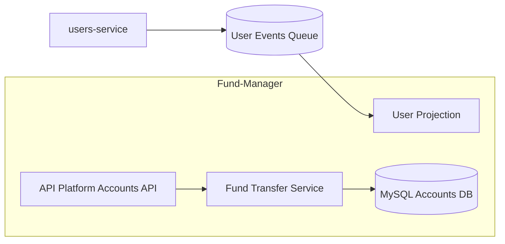
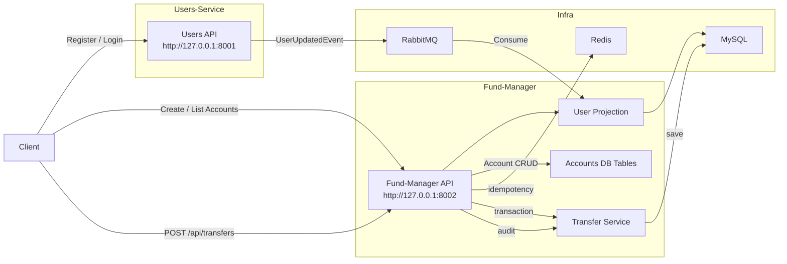

# 🏦 Fund Manager Service

**Secure Account Management & Fund Transfer Microservice (Symfony 7 + API Platform)**

This service is responsible for:

* Managing user financial accounts
* Performing **ACID-safe fund transfers**
* Enforcing account ownership with **JWT authentication**
* Maintaining a local user projection via **RabbitMQ events**
* Offering **REST APIs with API Platform**
* Ensuring **idempotent** financial operations using **Redis**
* Providing full functional test coverage for transfers

This service is part of the **Money Transfer Monorepo** and works together with the `users-service`.

---

## 📌 Features

### 🔐 Authentication
* Uses **LexikJWT** for decoding tokens issued by `users-service`.
* Stateless authentication on all `/api/*` routes.
* API Platform access control.

### 🧾 Accounts API (API Platform)
* Create account
* List user-owned accounts
* Retrieve single account
* All operations automatically restricted to the authenticated user

### 💰 Fund Transfers
* Transaction-safe balance modifications
* **Pessimistic locking** (`SELECT … FOR UPDATE`)
* **Idempotency key** support using Redis
* Proper validation & domain rules:
    * Sufficient balance
    * Same currency
    * User can transfer only between their own accounts

### 🔄 User Synchronization
* Consumes `UserUpdatedEvent` and `UserDeletedEvent` from **RabbitMQ**
* Keeps local `user_projection` table in sync
* Eliminates cross-service lookups during transfers

### 🧪 Test Suite
* Full functional tests using **Symfony WebTestCase**
* Clean test isolation via dedicated test DB

---

## 🧱 Architecture Diagram



## 🚀 Running the Service

### 1️⃣ Start infrastructure

```bash
make infra-up
```
Starts:
    * MySQL
    * Redis
    * RabbitMQ

### Start the users-service

```bash
cd services/users-service
php -S 127.0.0.1:8001 -d
```

### Start the Fund Manager API

```bash
cd services/fund-manager
php -S 127.0.0.1:8002 -t public
```
Swagger UI: 👉 http://127.0.0.1:8002/api/docs

###  Start the message consumer

```bash
cd services/fund-manager
php bin/console messenger:consume user_events -vv
```
This keeps the user projection in sync with users-service.

## Also these services can be start in its own Docker containers
### Start users-service in its own Docker container

```bash
make start-users-local
```
This will:
  * Install vendor dependencies via Composer (inside a temp container)
  * Mount your local services/users-service folder
  * Start a PHP local server inside the container

Expose the service at:
  * 👉 http://127.0.0.1:8001

You can now hit:
  * POST /api/register
  * POST /api/login
  * GET /api/docs (Swagger UI)

### Start fund-manager in its own Docker container
```
make start-fund-local
```
This will:
  * Install dependencies inside the container
  * Mount your local services/fund-manager folder
  * Start PHP server inside container

Expose the service at:
  * 👉 http://127.0.0.1:8002

Available endpoints include:
  * POST /api/accounts
  * GET /api/accounts
  * POST /api/transfers
  * GET /api/docs

### Users-service Swagger

👉 http://127.0.0.1:8001/api/docs

### Fund-manager Swagger

👉 http://127.0.0.1:8002/api/docs

If both open → you're good to go 🚀

### 🧪 Running Tests

### Create the test database

```bash
php bin/console doctrine:database:create --env=test
php bin/console doctrine:migrations:migrate --env=test --no-interaction
```

### Run tests

```bash
vendor/bin/simple-phpunit
```

## 📡 API Workflows
Below is the complete flow of how the frontend or API client interacts with both microservices.



### 🧩 1. Authentication & User Management (users-service)
Base URL: http://127.0.0.1:8001

### 1️⃣ Register User (users-service)
URL: http://127.0.0.1:8001/api/register

```bash
curl -X POST http://127.0.0.1:8001/api/register \
  -H "Content-Type: application/json" \
  -d '{"email":"alice@example.com","password":"secret"}'
```

### 2️⃣ Login to obtain JWT (users-service)
URL: http://127.0.0.1:8001/api/login
```bash
curl -X POST http://127.0.0.1:8001/api/login \
  -H "Content-Type: application/json" \
  -d '{"email":"alice@example.com","password":"secret"}'
```

### 3️⃣ Create an Account (fund-manager)
URL: http://127.0.0.1:8002/api/accounts

```bash
curl -X POST http://127.0.0.1:8002/api/accounts \
  -H "Authorization: Bearer <JWT_TOKEN>" \
  -H "Content-Type: application/json" \
  -d '{"balance":"1000.00","currency":"INR"}'
```

### 4️⃣ List Accounts (fund-manager)
URL: http://127.0.0.1:8002/api/accounts

```bash
curl -X GET http://127.0.0.1:8002/api/accounts \
  -H "Authorization: Bearer <JWT_TOKEN>"
```

### 5️⃣ Transfer Funds (fund-manager)
URL: http://127.0.0.1:8002/api/transfers

```bash
curl -X POST http://127.0.0.1:8002/api/transfers \
  -H "Authorization: Bearer <JWT_TOKEN>" \
  -H "Idempotency-Key: unique-key-123" \
  -H "Content-Type: application/json" \
  -d "{
        \"fromAccountUuid\": \"<FROM_UUID>\",
        \"toAccountUuid\":   \"<TO_UUID>\",
        \"amount\": \"250.00\",
        \"currency\": \"INR\"
      }"
```

### 6️⃣ Verify Updated Balances (fund-manager)
URL: http://127.0.0.1:8002/api/accounts

```bash
curl -X GET http://127.0.0.1:8002/api/accounts \
  -H "Authorization: Bearer <JWT_TOKEN>"
```